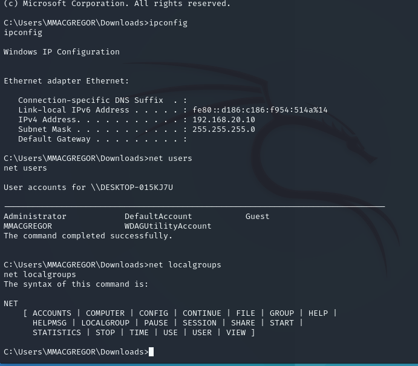

# HomeLab-Malware

<h2>Objectives:</h2>

•	Set up two VM machines. The first one would be the Attacker/Deploy system Kali Linux the second Windows 10 Pro Defender/Victim.

•	Kali system will use Nmap and MSF venom to deploy a malware attack using a reverse TCP 

•	Windows 10 pro will run Splunk to monitor

<h3>Experience:</h3>
As an aspiring SOC analyst, I was eager to expand my skills through a malware lab, which provided an excellent opportunity to showcase my capabilities. The lab offered a comprehensive overview of various industry tools and frameworks, allowing me to gain hands-on experience. Working with SIEMs, MSF Venom, and Splunk was both enjoyable and incredibly informative.
<h3>Project:</h3>
This lab simulates a real cyber-attack and endpoint detection and response. Utilizing MyDfir's YouTube Home lab project, I will use virtual machines to represent both the threat and victim systems. The attack machine will deploy MSF venom as a malware framework to target a Windows endpoint, which will be monitored by SPLUNK to observe the attack.

